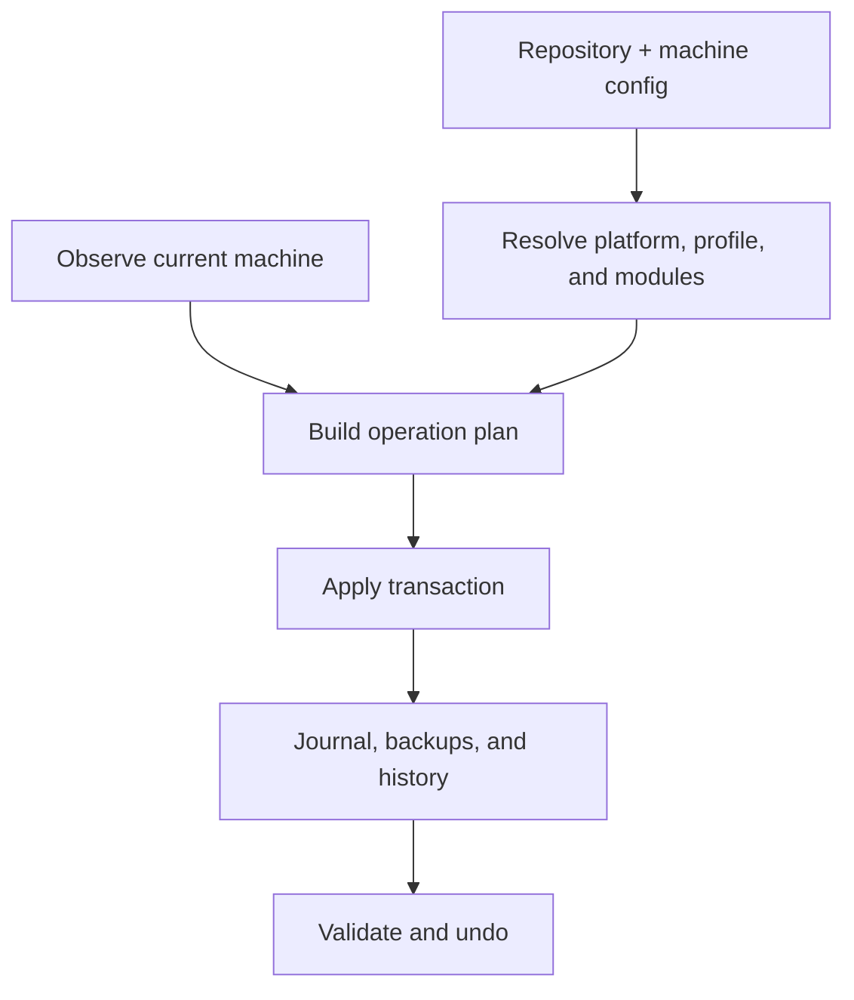

# Architecture

**Status: Go adoption and first permanent-core boundary accepted; permanent read-only core implemented; broader architecture proposed**

This document defines the working architecture for the future `dots` CLI. It separates durable boundaries from implementation choices that still require validation. Further Go implementation and migration are [paused](../plans/roadmap.md#current-priority); existing code, tests, and CI remain in place.

## Live Bash Framework

`bin/dots` locates the installation and delegates to `lib/dots/dispatch.bash`.
Routing probes only candidate filenames. `catalog.bash` owns static header parsing
and the shared built-in/help model; `ui.bash` is a sourceable presentation library;
`complete.bash` computes literal suggestions. Native adapter sources live under
`lib/dots/completion` and are linked into the repository's shell completion trees.
Only help/discovery/completion load the catalog. There is no catalog cache,
general transaction engine, or dependency on the Go binary. See [decision 0006](decisions/0006-bash-command-framework.md).

The [presentation contract](presentation.md) owns human output policy. `ui.bash` implements the shared Bash renderer; the file catalog's Python `Presentation` class mirrors it and requires policy parity checks when changed. Domain commands own their result data and choose human or data views explicitly. The dispatcher preserves extension streams; it does not decorate arbitrary output. This requirement applies to future authorized core work without changing the paused Go implementation.

## Existing Zsh Configuration

The live shell configuration is maintained independently of the paused Go core. `shells/zsh/zshrc` owns startup order; its `core/`, `integrations/`, and `platforms/` modules separate shared setup, tool activation, and execution-environment detection. Existing public module entry points remain available. Generated shell data belongs in user cache directories, not the repository. See the [Zsh guide](../shells/zsh/README.md).

## Implemented Permanent Core Boundary

Root `go.mod` (`github.com/5nik7/dots`, Go 1.27.1) and `cmd/dots` now own the separate permanent development binary. `internal/cli` binds help/version/doctor/commands/completion and renders registry and static extension metadata; `internal/dispatch` validates typed entries and resolves token routes/global spellings entirely in memory; `internal/platform` owns the ported read-only observations and file opening. `internal/extension` owns strict sidecar validation, explicit-root resolution and bounded enumeration; `internal/platform` owns native file/root policy and execution. `internal/cli/discovery.go` owns the public schema-1 catalog DTOs, shared in-memory construction and serialization over shared defensive projections and ordinary extension discovery. Public JSON types are separate from private registry/sidecar carriers; direct dispatch does not construct a catalog. No mutation API exists. The active `bin/dots` is a separate Bash command framework and may be maintained under the repository editing policy.

`tools/verify_core.py` copies only selected core inputs into owned temporary roots; `tools/ci_core.py` collects native check/startup/registry evidence. These tools are independent of the preserved experimental module and its collectors. CI runs both surfaces sequentially. The CLI logo/doctor adapters and explicit external resolver inspect their scoped runtime inputs; registry and candidate lookup have no filesystem/process dependencies. See [commands](commands.md#built-in-metadata-contract), [verification](testing.md#permanent-core-verification), and the [first-slice plan](../plans/phase-2-command-center.md).

## Implemented Experimental Boundary

`experiments/go-portability/` is an independent Go module containing a `cmd/dots-spike` entry point, private CLI and platform packages, test-only filesystem primitives, and a Python verification harness. It adds no root Go module and does not replace `bin/dots` or move live sources. The CLI owns only help, version, and read-only diagnostics; platform/runtime/path collection and platform-specific read-only file opening stay in the platform package. Logo lookup, size/type validation, and formatting stay in the CLI package. There is no resolver, extension dispatcher, state store, or mutation API.

The harness copies only experimental Go sources and the public `logo.txt` to a temporary build repository, isolates Go settings and caches, and retains reviewable binaries/evidence in a separate temporary artifact directory. Help reads a logo file at runtime rather than embedding another source copy. The executable uses only the Go standard library and invokes no subprocesses. Python, Go tools, and benchmark/inspection tools are development dependencies, not executable runtime dependencies.

The branch-specific Linux/Windows workflow provisions CI development tools and delegates check/distribution execution to `tools/ci_verify.py`. That collector owns sanitized source, runtime, and result artifacts outside the checkout; the shared verifier owns offline Go settings, telemetry isolation, fixture roots, and host-specific expectations. Recorded native Linux and Windows CI runs passed; claims remain limited to its experimental commands and disposable filesystem fixtures.

The verifier’s experimental `dist` mode delegates fixed-layout bundle encoding, checksum validation, and extraction to `tools/distribution.py`. It packages committed Go build identity and the committed public logo, then executes extracted artifacts in separate owned roots. This development boundary does not select a permanent release strategy, add an installer, or change the core command surface.

The [experiment plan](../plans/phase-1-portability.md) and [evaluation decision](decisions/0001-go-portability-experiment.md) record scope and evidence. The boundaries below remain the proposed production architecture; successful primitive tests do not implement transactions or managed-file safety.

## System Context

`dots` manages a repository-backed desired state for a user account. It observes the current machine, produces a plan, and applies approved operations through a transaction journal.



The same resolved plan representation should drive human previews, structured output, apply, tests, and recovery.

## Architectural Boundaries

### CLI and Dispatcher

The `dots` executable owns argument parsing, built-in route registration, longest-prefix external-command resolution, global output policy, and process exit behavior.

The common direct route must avoid loading the complete command registry or machine specification. Discovery-heavy operations such as `dots commands`, generated completions, and global help may load command metadata.

### Platform Adapter

The adapter reports detected platform evidence and normalized capabilities:

- Home, config, data, state, cache, temporary, and executable paths.
- File, directory, symbolic-link, junction, and hardlink support.
- Privilege mechanisms.
- Shell and profile locations.
- Package-manager availability.
- Path validation and platform-specific filesystem limits.

Portable core packages consume the adapter interface instead of branching on environment variables throughout the codebase.

### Configuration Loader

The loader reads repository configuration, machine-local configuration, explicit CLI overrides, and schema versions. It does not observe destination state or execute hooks.

### Resolver

The resolver selects modules from platform, profile, host, dependencies, and local overrides. It produces one deterministic desired specification with provenance for every selected resource.

The resolver detects dependency cycles, incompatible platform constraints, duplicate identifiers, and destination collisions before planning.

### Observer

The observer reads current filesystem and capability state without changing it. Expensive observations such as hashing are requested only when required by a comparison policy.

### Planner

The planner compares desired resources with observed state and emits ordered operations, no-ops, warnings, conflicts, blocked operations, backup requirements, and reversibility classifications.

Planning is read-only. Interactive approval happens after the plan exists.

### Transaction Engine

The transaction engine applies a validated plan while maintaining a durable journal. It owns locks, operation boundaries, backups, atomic replacement where supported, rollback, recovery, and undo validation.

Extensions cannot claim transactional management for direct unjournaled writes.

### State Store

The state store is outside the repository and contains:

- Machine selection and non-secret local state.
- Transaction journals.
- Backups.
- Locks.
- Recovery markers.
- Generated indexes or caches that can be rebuilt.

State formats require schema versions and safe atomic updates.

### Package Adapters

Package adapters translate normalized package identifiers into manager-specific queries and installations. They record whether a package was already installed and whether `dots` added it.

Package changes share the plan and journal vocabulary but do not promise automatic removal during ordinary filesystem undo.

### External Commands

External executables named `dots-*` add cohesive commands. The dispatcher maps hyphenated filenames to space-separated routes and resolves the longest match.

Extension discovery and metadata are described in `commands.md`. Extensions may call stable core interfaces, but must not duplicate the resolver or transaction engine.

## Working Implementation Direction

[Decision 0002](decisions/0002-phase-1-go-adoption.md) accepts Go, the initial toolchain/development targets, warm-start policy, minimal bundle/release-trust direction, and additive permanent-core/registry scope. Native Termux and Linux/Windows CI evidence supports that decision; it does not establish production OS floors, representative desktop performance, or controlled cold-cache results.

The first permanent implementation uses root `go.mod`, `cmd/dots`, and private CLI, dispatch, and platform packages for the approved read-only built-ins. Its [bounded file and test scope](decisions/0002-phase-1-go-adoption.md#next-bounded-implementation-task) is implemented in the bounded first slice. The independent experiment and its historical output remain unchanged; its provisional-language banner predates adoption. External execution, manifests, state, and transactions stay outside the first slice.

POSIX shell and PowerShell remain intended bootstrap and extension boundaries. They must not become separate implementations of desired-state resolution or transactions. Public release and remote bootstrap remain gated by the accepted trust requirements and deferred verification work in decision 0002.

## Target Repository Shape

The target is an incremental destination, not authorization for a wholesale move:

```text
dots/
├── cmd/dots/                 compiled CLI entry point
├── internal/                 private core packages
│   ├── cli/
│   ├── extension/             implemented development resolver
│   ├── dispatch/
│   ├── platform/
│   ├── config/
│   ├── spec/
│   ├── observe/
│   ├── plan/
│   ├── apply/
│   ├── state/
│   └── packages/
├── commands/                 official external dots-* commands
├── modules/                  repository-managed desired-state modules
├── profiles/                 profile and optional host composition
├── bootstrap/                minimal POSIX shell and PowerShell installers
├── agents/guides/            task-specific agent procedures
├── docs/                     contributor reference
├── plans/                    active implementation plans
├── schemas/                  machine-readable schemas when introduced
├── tests/                    unit fixtures and integration harnesses
├── dots.toml                 repository configuration
├── AGENTS.md
└── README.md
```

Existing `bin/`, `config/`, `shells/`, `themes/`, platform submodules, and other live directories remain in place until a focused module migration moves their ownership.

The optional `config/nvim` submodule owns independently versioned Neovim configuration source. The parent repository owns its source declaration and pinned commit, with explicit initialization and update described in the [README](../README.md#optional-neovim-configuration). This addition provides no core manifest, managed activation, plugin installation, or runtime-state ownership; existing live configuration remains in place.

## Storage Boundaries

The repository stores source configuration and versioned manifests. Machine-local configuration and runtime state remain outside it.

| Data | Unix, Termux, and WSL default | Native Windows default |
| --- | --- | --- |
| Repository | `~/dots` initially, configurable | `%USERPROFILE%\dots` initially, configurable |
| Machine config | `$XDG_CONFIG_HOME/dots/config.toml` or `~/.config/dots/config.toml` | `%APPDATA%\dots\config.toml` |
| State and journals | `$XDG_STATE_HOME/dots` or `~/.local/state/dots` | `%LOCALAPPDATA%\dots\state` |
| Cache | `$XDG_CACHE_HOME/dots` or `~/.cache/dots` | `%LOCALAPPDATA%\dots\cache` |

Backups must not be stored only inside the repository they are protecting against replacement or loss.

## Resolution and Apply Flow

1. Locate repository and machine configuration.
2. Detect or validate platform and capabilities.
3. Select profile and optional host.
4. Load only referenced modules and their dependencies.
5. Resolve variables and destinations.
6. Reject invalid paths, cycles, collisions, and unsupported required capabilities.
7. Observe current target state.
8. Build an ordered plan.
9. Present, serialize, or approve the plan.
10. Create a transaction journal and lock.
11. Apply operations and record each durable boundary.
12. Roll back on failure or finalize transaction history on success.

## Update Boundaries

These are deliberately separate operations:

- Updating the `dots` executable.
- Pulling the dotfiles repository.
- Synchronizing optional/private sources.
- Installing missing packages.
- Applying the resolved desired state.
- Upgrading already installed packages.

A future convenience workflow may compose them, but each stage must remain visible, separately testable, and separately recoverable.

## Trust Model

The repository and its enabled extensions are executable trust inputs. Public bootstrap should establish the core and public repository without implicitly expanding trust to private submodules or arbitrary commands found anywhere on `PATH`.

[Decision 0003](decisions/0003-trusted-external-command-protocol.md) fixes explicit prefix-only roots, duplicate refusal, static JSON and native adapters for development dispatch. Root selection trusts code and its parent directories; validation does not authenticate publishers, sandbox code or prevent concurrent replacement. Secrets and credentials are never ordinary diagnostic fields.

## Local Development Worktree Tooling

`tools/worktree_lifecycle.py` manages explicitly enrolled development worktrees independently of the public CLI and transaction architecture. It owns only Git-local enrollment/lock metadata and guarded calls to non-force Git worktree removal. Ordinary maintenance uses the existing checkout without invoking this helper. Optional worktree procedures, known-live-use review and platform limitations are defined in the [agent worktree guide](../agents/guides/worktrees.md). No CLI command, configuration loader, hook or background service is added.

The [Zsh renderer](decisions/0005-static-zsh-completion.md) in `internal/cli/completion.go` consumes that catalog after full validation. It owns shell quoting and a static embedded route/root snapshot, without adding I/O dependencies to dispatch or runtime discovery to shell startup.

## File Catalog and Configuration Layout

`config/` is the canonical source directory; `configs -> config` is a temporary
compatibility alias in the parent and platform repositories. The parent owns the
Neovim gitlink at `config/nvim`; Neovim retains independent Git history.
`tools/migrate_config_paths.py` previews and journals identity-preserving retargeting
of existing home links. It is separate from a future general installation engine.

`.dots/sources.json` owns repository composition and exclusions. Each repository owns
its `.dots/files.json` resource metadata. `lib/dots/files/catalog.py` owns terminal presentation using the Bash UI color/icon policy, validation,
read-only observation/discovery, classification and atomic metadata tracking. Thin
`bin/dots-files-*` commands expose this through the Bash dispatcher; completion uses
the same data reader directly without extension execution. See [files](files.md).

## Shared Theme Engine

`lib/dots/themes` owns native palette loading, semantic colors, literal template
rendering, cached initialization, compatibility APIs, journaled publication, fixed
application connectors, Git source lifecycle and explicit wallpaper adapters.
`bin/dots-theme-*` exposes the flat workflow; `dots-themes-*` preserves legacy routes.
`themes/bin/*` remains compatibility entry points, with shared shell logic in `lib`.

Flat `themes/ID` variants own semantic `colors.toml`, optional native `palette.toml`
and backgrounds. `default/themed` owns bundled templates; per-user `dots/themed`
overrides them. User-installed themes contribute data only. The stable XDG state
`dots/current/theme` symlink selects a generation under `dots/themes/generations`.
Journals preserve previous pointers and fixed app connector objects. Application
settings remain in `config`; generated palettes, bat caches, backups and wallpaper
selection records belong in machine-local state. Connector paths beneath symlinked
app directories may physically reside in a repository and must not be published as
machine-specific configuration.

The separate local Anodize.nvim plugin owns Neovim palette normalization, rendering
and reload lifecycle. `config/nvim/lua/util/dots_theme.lua` preserves the startup,
reload and dashboard interfaces; `dots_theme_legacy.lua` retains bounded raw data
for compatibility helpers only. Personal highlights and lualine configuration
remain Dots-owned. The old native adapter module is retained for compatibility,
but is not part of startup or automatic reload. Zsh continues reading generated
shell data. Wallpaper actions remain explicit capability-checked adapters. See
[themes](themes.md), [Anodize](anodize.md#neovim-integration), and
[decision 0008](decisions/0008-config-catalog-and-theme-apps.md).

## Git and file operation engines

Under [decision 0010](decisions/0010-git-and-managed-file-operations.md), `lib/dots/git` owns the adapted, attributed Git engine and uses shared Bash UI helpers. Inspection and mutation are separate modules, with static command metadata and no standalone git-it dependency. Git operations are incremental and preserve partial results.

`lib/dots/files/manage.py` composes location registries, catalog ownership, preview and presentation. `transactions.py` owns durable staging, object integrity, locks, replacement, rollback, snapshots and recovery. Every mutating file route uses it; `track` remains metadata-only. Catalog and location data belong to their owning repositories. User preferences and transaction/backup records belong in XDG config/state. This is a bounded POSIX implementation, not the general Go module/profile engine.

## Anodize authoring boundary

The owner-authorized [Anodize slice](anodize.md) is an exception to the general Go pause. `anodize/` is an independent pure Go color engine; `lib/dots/anodize/` owns Python authoring and the private Bash publication bridge. It reuses `files/transactions.py` and existing theme rendering/publication. `bin/anodize` and static `dots-anodize-*` routes provide CLI access. No engine calls occur during shell startup. See [decision 0011](decisions/0011-anodize-authoring.md).

Anodize standalone completion reuses generated copies of the shared Bash/Zsh/Fish adapters. Its private query bridge translates the standalone command line into the Dots completion protocol, reading bundled static headers and the selected theme repository without executing leaf commands or the Go engine. `tools/generate_anodize_integration.py` owns reproducible adapter generation and `man/anodize.1`; command and option text in the manual comes from the Python parser.
