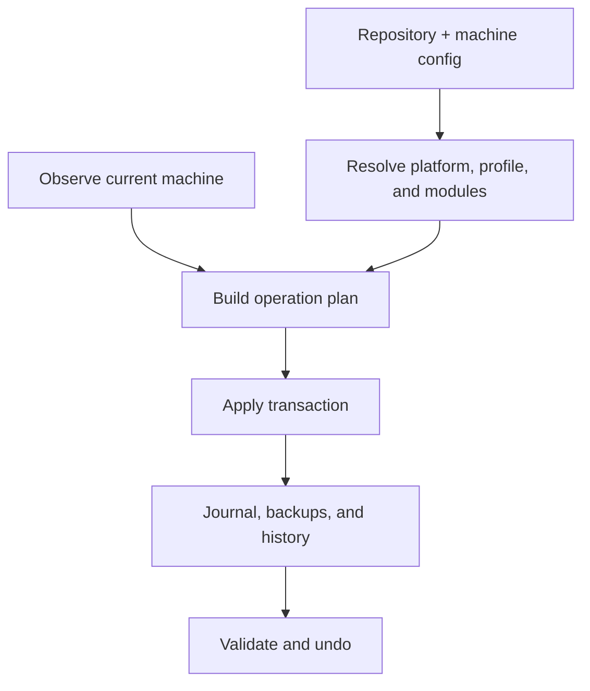

# Architecture

**Status: Proposed architecture; isolated Termux portability experiment implemented**

This document defines the working architecture for the future `dots` CLI. It separates durable boundaries from implementation choices that still require validation.

## Implemented Experimental Boundary

`experiments/go-portability/` is an independent Go module containing a `cmd/dots-spike` entry point, private CLI and platform packages, test-only filesystem primitives, and a Python verification harness. It adds no root Go module and does not replace `bin/dots` or move live sources. The CLI owns only help, version, and read-only diagnostics; platform/runtime/path collection and platform-specific read-only file opening stay in the platform package. Logo lookup, size/type validation, and formatting stay in the CLI package. There is no resolver, extension dispatcher, state store, or mutation API.

The harness copies only experimental Go sources and the public `logo.txt` to a temporary build repository, isolates Go settings and caches, and retains reviewable binaries/evidence in a separate temporary artifact directory. Help reads a logo file at runtime rather than embedding another source copy. The executable uses only the Go standard library and invokes no subprocesses. Python, Go tools, and benchmark/inspection tools are development dependencies, not executable runtime dependencies.

The [experiment plan](../plans/phase-1-portability.md) and [evaluation decision](decisions/0001-go-portability-experiment.md) record scope and evidence. The boundaries below remain the proposed production architecture; successful primitive tests do not implement transactions or managed-file safety.

## System Context

`dots` manages a repository-backed desired state for a user account. It observes the current machine, produces a plan, and applies approved operations through a transaction journal.



The same resolved plan representation should drive human previews, structured output, apply, tests, and recovery.

## Architectural Boundaries

### CLI and Dispatcher

The `dots` executable owns argument parsing, built-in route registration, longest-prefix external-command resolution, global output policy, and process exit behavior.

The common direct route must avoid loading the complete command registry or machine specification. Discovery-heavy operations such as `dots commands`, generated completions, and global help may load command metadata.

### Platform Adapter

The adapter reports detected platform evidence and normalized capabilities:

- Home, config, data, state, cache, temporary, and executable paths.
- File, directory, symbolic-link, junction, and hardlink support.
- Privilege mechanisms.
- Shell and profile locations.
- Package-manager availability.
- Path validation and platform-specific filesystem limits.

Portable core packages consume the adapter interface instead of branching on environment variables throughout the codebase.

### Configuration Loader

The loader reads repository configuration, machine-local configuration, explicit CLI overrides, and schema versions. It does not observe destination state or execute hooks.

### Resolver

The resolver selects modules from platform, profile, host, dependencies, and local overrides. It produces one deterministic desired specification with provenance for every selected resource.

The resolver detects dependency cycles, incompatible platform constraints, duplicate identifiers, and destination collisions before planning.

### Observer

The observer reads current filesystem and capability state without changing it. Expensive observations such as hashing are requested only when required by a comparison policy.

### Planner

The planner compares desired resources with observed state and emits ordered operations, no-ops, warnings, conflicts, blocked operations, backup requirements, and reversibility classifications.

Planning is read-only. Interactive approval happens after the plan exists.

### Transaction Engine

The transaction engine applies a validated plan while maintaining a durable journal. It owns locks, operation boundaries, backups, atomic replacement where supported, rollback, recovery, and undo validation.

Extensions cannot claim transactional management for direct unjournaled writes.

### State Store

The state store is outside the repository and contains:

- Machine selection and non-secret local state.
- Transaction journals.
- Backups.
- Locks.
- Recovery markers.
- Generated indexes or caches that can be rebuilt.

State formats require schema versions and safe atomic updates.

### Package Adapters

Package adapters translate normalized package identifiers into manager-specific queries and installations. They record whether a package was already installed and whether `dots` added it.

Package changes share the plan and journal vocabulary but do not promise automatic removal during ordinary filesystem undo.

### External Commands

External executables named `dots-*` add cohesive commands. The dispatcher maps hyphenated filenames to space-separated routes and resolves the longest match.

Extension discovery and metadata are described in `commands.md`. Extensions may call stable core interfaces, but must not duplicate the resolver or transaction engine.

## Working Implementation Direction

A compiled Go core remains the working recommendation. The isolated Termux experiment now supplies startup and filesystem evidence; adoption still requires owner review and distribution/desktop validation. Evaluate the direction against these criteria:

- A supported Android/Termux artifact can be built and distributed reliably.
- Startup performance is acceptable on the target device.
- Required filesystem and symlink operations behave correctly.
- The binary has no undeclared runtime dependencies.

POSIX shell and PowerShell remain necessary for initial download/install and platform-specific extensions. They should not become separate implementations of desired-state resolution or transactions.

Record the final language decision in `docs/decisions/` after the spike.

## Target Repository Shape

The target is an incremental destination, not authorization for a wholesale move:

```text
dots/
├── cmd/dots/                 compiled CLI entry point
├── internal/                 private core packages
│   ├── dispatch/
│   ├── platform/
│   ├── config/
│   ├── spec/
│   ├── observe/
│   ├── plan/
│   ├── apply/
│   ├── state/
│   └── packages/
├── commands/                 official external dots-* commands
├── modules/                  repository-managed desired-state modules
├── profiles/                 profile and optional host composition
├── bootstrap/                minimal POSIX shell and PowerShell installers
├── agents/guides/            task-specific agent procedures
├── docs/                     contributor reference
├── plans/                    active implementation plans
├── schemas/                  machine-readable schemas when introduced
├── tests/                    unit fixtures and integration harnesses
├── dots.toml                 repository configuration
├── AGENTS.md
└── README.md
```

Existing `bin/`, `configs/`, `shells/`, `themes/`, platform submodules, and other live directories remain in place until a focused module migration moves their ownership.

## Storage Boundaries

The repository stores source configuration and versioned manifests. Machine-local configuration and runtime state remain outside it.

| Data | Unix, Termux, and WSL default | Native Windows default |
| --- | --- | --- |
| Repository | `~/dots` initially, configurable | `%USERPROFILE%\dots` initially, configurable |
| Machine config | `$XDG_CONFIG_HOME/dots/config.toml` or `~/.config/dots/config.toml` | `%APPDATA%\dots\config.toml` |
| State and journals | `$XDG_STATE_HOME/dots` or `~/.local/state/dots` | `%LOCALAPPDATA%\dots\state` |
| Cache | `$XDG_CACHE_HOME/dots` or `~/.cache/dots` | `%LOCALAPPDATA%\dots\cache` |

Backups must not be stored only inside the repository they are protecting against replacement or loss.

## Resolution and Apply Flow

1. Locate repository and machine configuration.
2. Detect or validate platform and capabilities.
3. Select profile and optional host.
4. Load only referenced modules and their dependencies.
5. Resolve variables and destinations.
6. Reject invalid paths, cycles, collisions, and unsupported required capabilities.
7. Observe current target state.
8. Build an ordered plan.
9. Present, serialize, or approve the plan.
10. Create a transaction journal and lock.
11. Apply operations and record each durable boundary.
12. Roll back on failure or finalize transaction history on success.

## Update Boundaries

These are deliberately separate operations:

- Updating the `dots` executable.
- Pulling the dotfiles repository.
- Synchronizing optional/private sources.
- Installing missing packages.
- Applying the resolved desired state.
- Upgrading already installed packages.

A future convenience workflow may compose them, but each stage must remain visible, separately testable, and separately recoverable.

## Trust Model

The repository and its enabled extensions are executable trust inputs. Public bootstrap should establish the core and public repository without implicitly expanding trust to private submodules or arbitrary commands found anywhere on `PATH`.

Extension search locations, precedence, and opt-in rules must be documented before external discovery is enabled. Secrets and credentials are never ordinary diagnostic fields.
